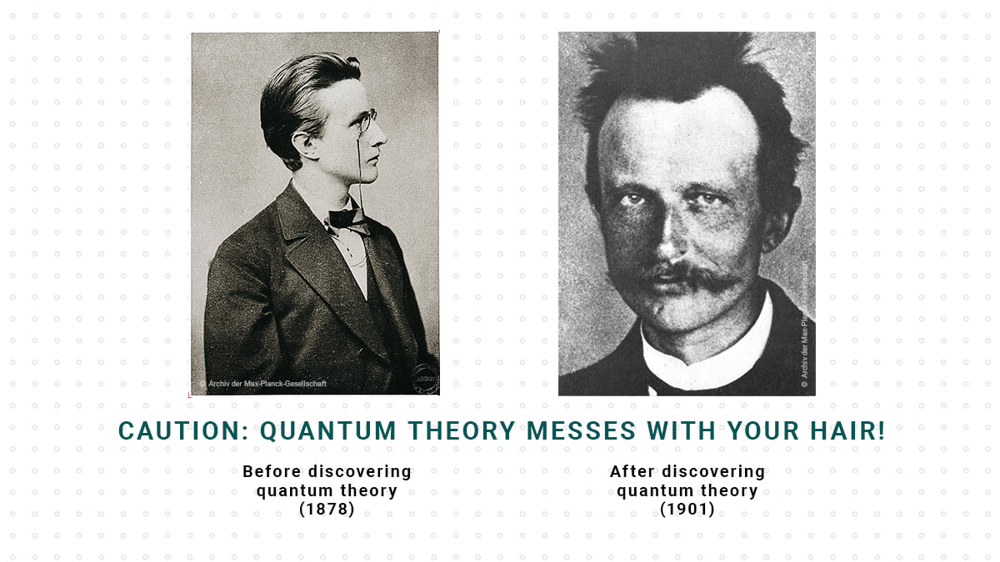

# Page 1

#### The Dangers of Quantum Knowledge

Quantum mechanics, by its very nature, is incredibly complex and counterintuitive. The study of quantum phenomena can challenge one's fundamental understanding of reality, as it often defies classical logic and common sense. This complexity can lead to confusion and frustration for those attempting to comprehend its concepts.

Furthermore, the technical applications of quantum theory, such as quantum computing and quantum cryptography, have far-reaching implications for security systems worldwide. A deep understanding of quantum mechanics could enable individuals to break encryption codes, potentially leading to breaches of national security or privacy invasions.

Lastly, the esoteric nature of quantum mechanics can often lead to philosophical and existential questions that may be unsettling. The notion of superposition, entanglement, and the observer effect can suggest that the nature of reality is fundamentally different from our everyday experiences, which can be a daunting realization.

In sum, while quantum theory is a fascinating and powerful field of study, its complexity, potential impact on security, and mind-bending implications pose significant challenges and hazards for those who delve too deeply without caution.

